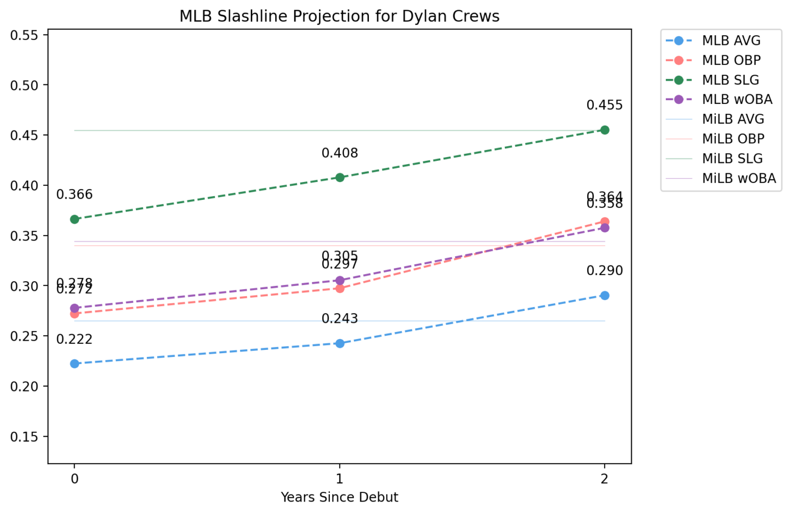
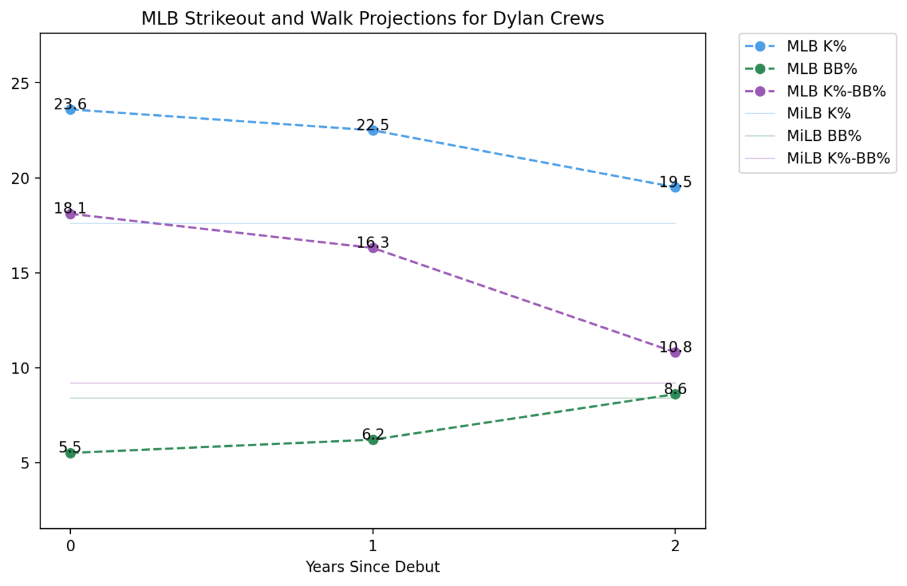

# MiLB Player Future Statline Projector

## Summary

This streamlit application allows users to select a minor league baseball player from 2024 (who has at least 150 pitches thrown/faced tracked by statcast), and predict their MLB statistics for their debut year, and the 2 years that follow. The app uses a linear regression model to predict MiLB players' major league statistics. The model is trained on data from players promoted to MLB from 2021-2023, using their MiLB data as the features, and their MLB data as the target. Models are seperated for debut year, debut + 1, and debut + 2 years, in order to get a better idea of players' progession as they spend more time in MLB. The app outputs two plots. The first plot contains predictions for the player's batting average (AVG), on-base percentage (OBP), slugging percentage (SLG), and [weighted on-base average (wOBA)](https://www.mlb.com/glossary/advanced-stats/weighted-on-base-average). The second plot contains predictions for the player's strikeout percentage (K%), walk percentage (BB%), and strikeout percentage minus walk percentage (K%-BB%). For pitchers, these statistics refer to the values allowed to batters they face.

## Example Case: Dylan Crews

Dylan Crews is the #1 prospect in baseball according to [MLB.com prospect rankings](https://www.mlb.com/milb/prospects/top100/).


**Dylan Crews Slashline Predictions**



**Dylan Crews Strikeout and Walk Rate Predictions**



## Requirements

- requests
- bs4
- pandas
- numpy
- python-TIME
- streamlit
- matplotlib
- scikit-learn

## Installation and Usage

- Clone and enter the repository:

  ```sh
  git clone <repo_url>
  cd <repo_directory>
  ```

- Install requirements

  ```sh
  pip install -r requirements.txt
  ```

- Run App

  ```sh
  streamlit run app.py
  ```

- In a browser open the local host url shown by streamlit

- Select a position (pitcher or batter) and a player

## Program Explanation

### milb_savant_scraper.py and mlb_savant_scraper.py

Both of these programs use BeautifulSoup to fetch statcast data from the Baseball Savant website. The data fetched from Baseball Savant for each year is put into a dataframe, and saved into data folders as csv files to be used in another program.

### model.py

This program is where the data is cleaned and pre-processed, as well as where the models are trained. Cleaning included dropping disruptive columns, reformatting player names, dropping duplicate player instances, and filtering for only players who have played in both MiLB and MLB. After the cleaning and pre-processing function are the train_batter() and train_pitcher() functions, which take in the player data, feature columns, and target columns, then trains a linear regression model from scikit-learn. 

### plots.py

This program contains functions which use matplotlib to plot the data outputted from the model for a single player. The functions take in milb data, as well as year 0, 1, and 2 prediction data to generate the plots which are implemented in the streamlit app. One function plots the slashline statistics, and the other plots strikeout and walk rate statistics.

### app.py

This program is where the model and plots programs come together to create the streamlit app. The 2024 statcast data for MiLB players is loaded in and cleaned so that the model can use the players' MiLB statistics to predict their MLB statistics. The remainder of the code takes the user selection of position and player to determine which player to put through the linear regression model and create output plots for. 


